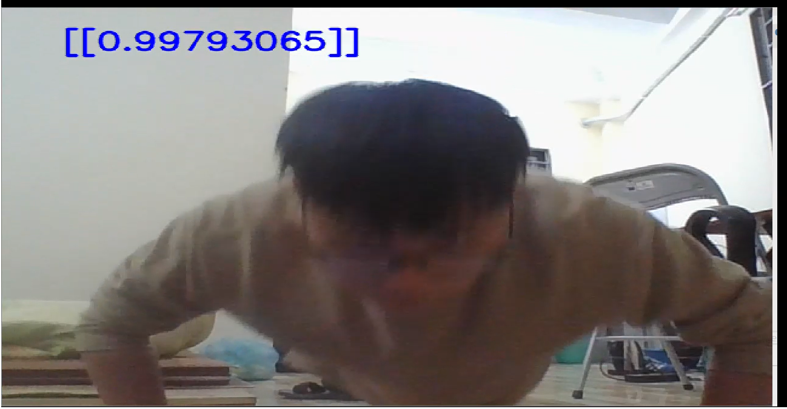

# Pushup Recognition

<a href="https://youtu.be/EPBnpKRRuG0"></a>
### Description:

Repo containts training code for pushup recognition via images.

This is part of our pushup-counter project. 
    [https://github.com/VNOpenAI/pushup-counter-app](https://github.com/VNOpenAI/pushup-counter-app)


### Prerequisites.

Before you continue, ensure you meet the following requirements:
 
* You have installed the Python3.
* Setup your enviroment by: `!pip install -r requirement.txt`.
* Download data [here](https://drive.google.com/drive/folders/1M15tVEjIEBHcodP6WO690QiwOkyKQeWR?usp=sharing).
* Download pre-train model [here](https://drive.google.com/file/d/1Ik_6oQXkhJqH1bJPOE6NDtUS8OB73wHP/view?usp=sharing)

note: Download file `data.zip` and unzip, put it in the same folder with your code. 
    
### Run demo:
```
    !python demo.py
```